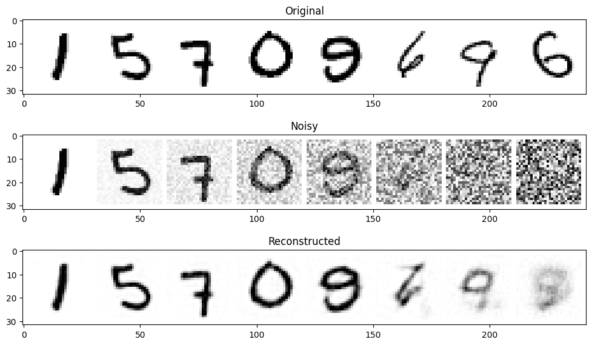
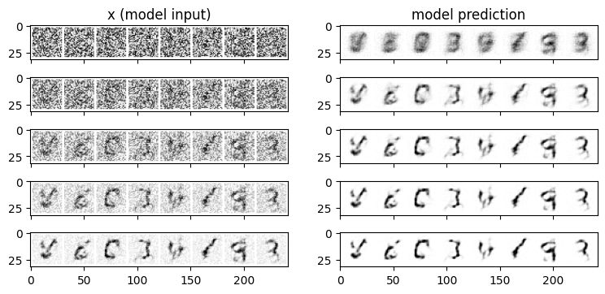
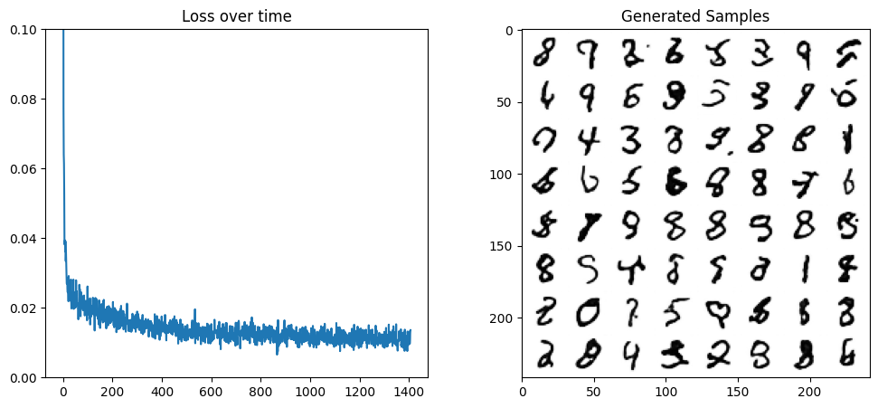
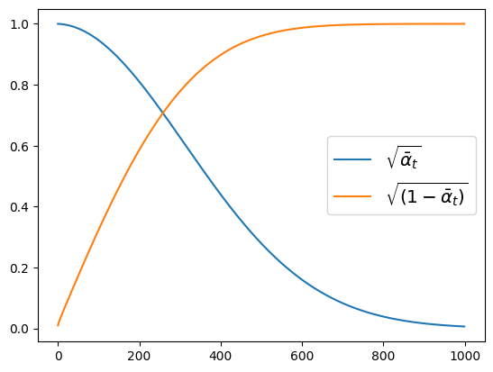
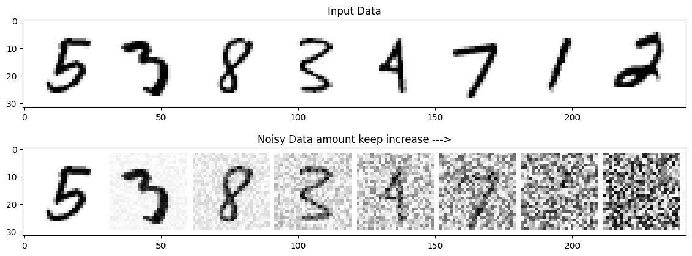
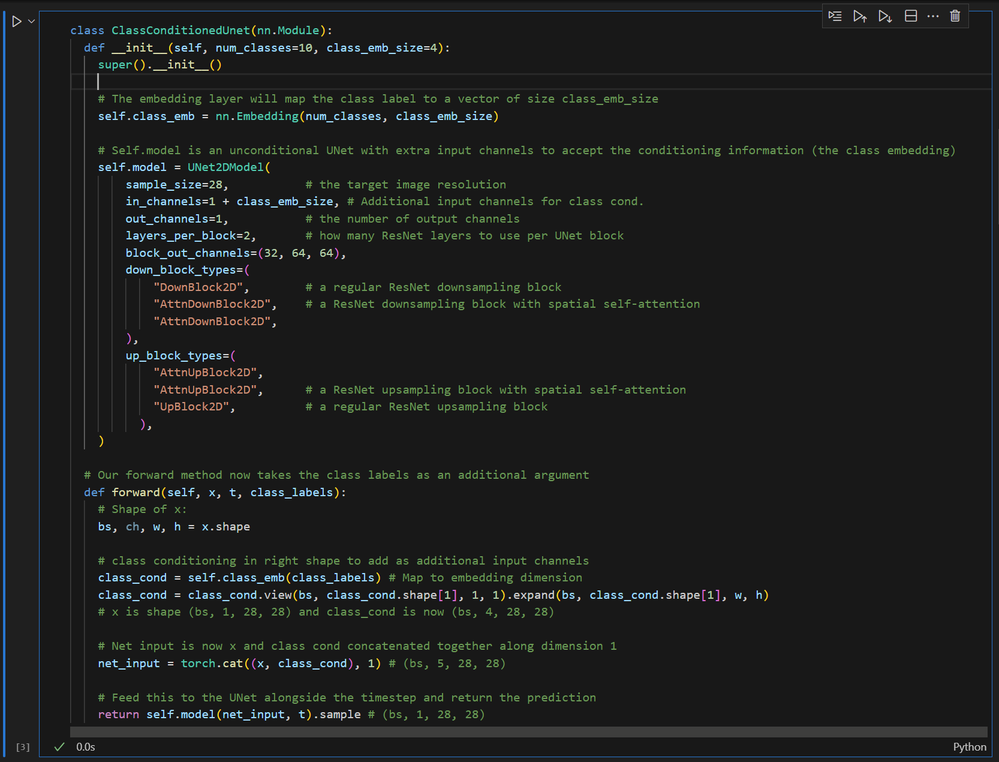
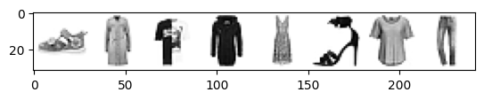
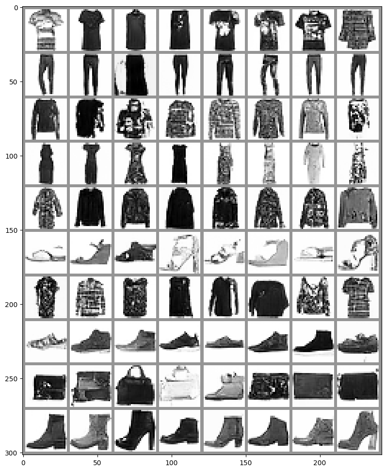

# experiment results

Diffusion models operate on a fascinating principle of gradually transforming data between two states: from structured information to random noise, and back again. During training, the model learns by observing how images degrade when noise is systematically added to them. This process is reversed during generation, where the model starts with pure noise and progressively refines it into a coherent image through multiple small steps.

# DPPM parts 1

The model's predictions become less accurate when dealing with heavily noised images. When noise levels are low, the model can make accurate predictions about the original image, but as noise increases to maximum levels, the model tends to produce blurry, generic outputs that represent an average of the training dataset.

Instead of trying to denoise an image completely in one step, the process takes a more gradual approach. Starting with random noise, the model makes a prediction about what the denoised image should look like, but only moves partially (about 20%) toward that prediction. This creates a slightly less noisy image with subtle structural hints, which then serves as input for the next prediction. Each subsequent prediction tends to be more accurate than the last, as the input becomes progressively clearer.

## The Corruption Process
The DDPM paper describes a corruption process that adds a small amount of noise for every 'timestep'. Given $x_{t-1}$ for some timestep, we can get the next (slightly more noisy) version $x_t$ with:

$$
q(\mathbf{x}_t \vert \mathbf{x}_{t-1}) = \mathcal{N}(\mathbf{x}_t; \sqrt{1 - \beta_t} \mathbf{x}_{t-1}, \beta_t\mathbf{I}) \quad
$$

$$
q(\mathbf{x}_{1:T} \vert \mathbf{x}_0) = \prod^T_{t=1} q(\mathbf{x}_t \vert \mathbf{x}_{t-1})
$$

we take $x_{t-1}$ , scale it by $\sqrt{1 - \beta_t}$ and add noise scaled by $\beta_t$. This $\beta$ is defined for every t according to some schedule, and determines how much noise is added per timestep. Now, we have another formula to get $x_t$ for any t given $x_0$

$$
q(\mathbf{x}_t \vert \mathbf{x}_0) = \mathcal{N}(\mathbf{x}_t; \sqrt{\bar{\alpha}_t} \mathbf{x}_0, \sqrt{(1 - \bar{\alpha}_t)} \mathbf{I})
$$

where $\bar{\alpha}_t = \prod_{i=1}^T \alpha_i$ and $\alpha_i = 1-\beta_i$

We can plot $\sqrt{\bar{\alpha}_t}$ and $\sqrt{(1 - \bar{\alpha}_t)}$ to view how the input (x) and the noise are scaled and mixed across different timesteps:

## The Denoising Process

The denoising process is the inverse of the corruption process. Given a noisy image $x_t$ and the corresponding timestep t, we want to predict the next clean image $x_{t-1}$:

$$
p(\mathbf{x}_{t-1} \vert \mathbf{x}_t, t) = \mathcal{N}(\mathbf{x}_{t-1}; \mu_t(\mathbf{x}_t, t), \Sigma_t(\mathbf{x}_t, t))
$$

We want an easy way to control the amount of corruption. So we take in a parameter for the amount of noise to add. If amount = 0, input without any changes. If amount gets up to 1, we get back noise with no trace of the input x. By mixing the input with noise this way, we keep the output in the same range (0 to 1).

`noisy_x =  (1-amount)*x + amount*noise`

# DPPM parts 2
Here we define a class-conditioned UNet model for image generation that incorporates class information into the generation process. The ClassConditionedUnet extends the basic UNet architecture by adding class conditioning capabilities. It uses an embedding layer to transform class labels into continuous vectors, which are then integrated into the image generation process.

The model's architecture is built around a UNet2DModel that processes 28x28 pixel images. The input channels are expanded to accommodate both the image data and the class embedding information. The network's structure consists of multiple downsampling and upsampling blocks, with some blocks incorporating spatial self-attention mechanisms. Specifically, it uses three levels of resolution with channel dimensions of 32 and 64, implementing a combination of regular ResNet blocks and attention-enabled blocks for both downsampling and upsampling paths.

The model's architecture is built around a UNet2DModel that processes 28x28 pixel images. The input channels are expanded to accommodate both the image data and the class embedding information. The network's structure consists of multiple downsampling and upsampling blocks, with some blocks incorporating spatial self-attention mechanisms. Specifically, it uses three levels of resolution with channel dimensions of 32 and 64, implementing a combination of regular ResNet blocks and attention-enabled blocks for both downsampling and upsampling paths.

We are using fashion_mnist to regenerate: 

# DDPM parts 3

Not done, i wanna do it in anthor dataset

# SD parts
這裡我們用的 StableDiffusionPipeline 比前面幾個單元的 DDPMPipeline 複雜一點。除了 UNet 和調度器之外，管線內還有很多其它的組成部分：

## VAE
## Text encoder
## UNET